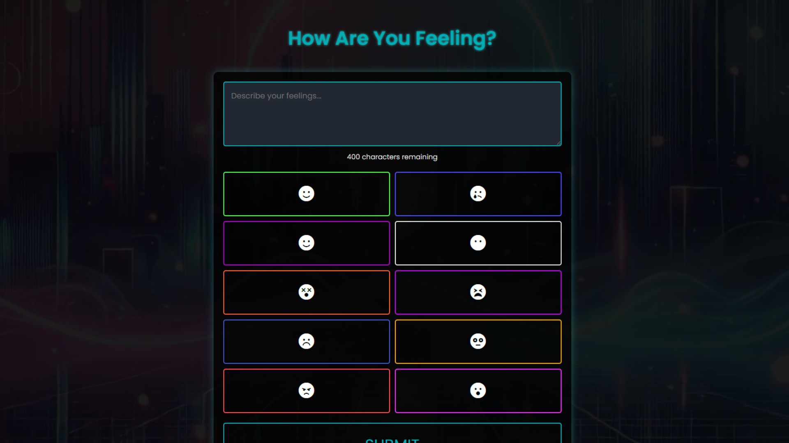
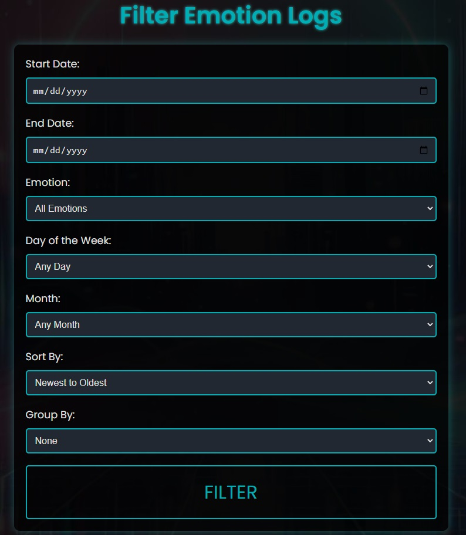
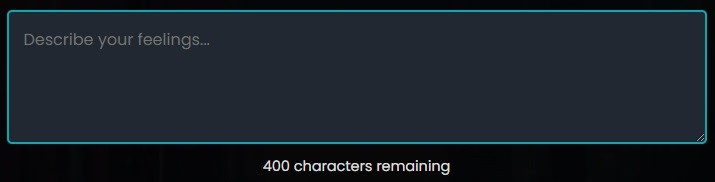
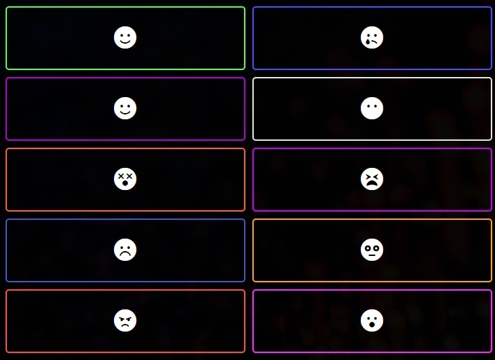
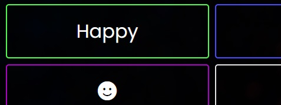
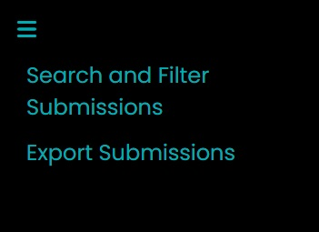

# YOFT (Yet O-nother Feeling Tracker) - Self-Hosted Opensource Emotion and Mood Journaling App



The entire purpose of this project is to self host your own emotional well-being web application for simple journaling in order to be able to reflect on at a later time. This can be for your own introspection or for recalling events, understanding your own emotional patterns and triggers, etc.  Can be used as a tool for your own healing journey to better understand what your triggers are, when things are going well or even potentially where your anxiety comes from.

This application does not gaurantee a better life, nor does it claim to do so. This is simply a journaling tool. One that *may* help you track your journey and patterns.  It's designed to be simple and uncomplicated. Both in usage, and management of it. I hope you enjoy it and find use in it. 

Feel free to clone this, make it your own, etc. 

## Table of Contents
- [Demo](#demo)
- [Overview](#overview)
- [Supported OS's](#tested-operating-systems)
- [Features](#features)
  - [Homepage](#homepage)
  - [Filter Page](#filter-page)
  - [Backend Features](#backend-features)
- [Usage](#usage)
  - [Journaling](#the-journal)
  - [The Emotions](#the-emotions)
  - [Exporting](#exporting-submission-history)
- [Packages and Technologies Used](#packages-and-technologies-used)
  - [Packages](#packages)
  - [Technologies](#technologies)
- [Webroot Directory File Structure](#webroot-directory-file-structure)
- [Installation](#installation)
  - [Important Note](#note)
  - [Step 1: Download and Prepare Files](#step-1-download-and-prepare-necessary-installation-files)
    - [Available Script Arguments](#available-script-arguments)
  - [Step 2: Install the webserver and packages](#step-2-install-the-webserver-and-needed-dependancy-packages)
  - [Step 3: Update Nginx host conf file](#step-3-update-your-nginx-conf-file)
  - [Step 4: Verify firewall rules](#step-4-ensure-firewall-rules-allow-for-80-and-443)
  - [Step 5: Enable SSL](#step-5-enable-ssl)
  - [Step 6: Test the website](#step-6-test-your-website)
- [Managing the application](#managing-the-application)
  - [Backup your database](#backing-up-your-database)
  - [Restore your database](#restore-your-database)
  - [Update to a new version](#update-to-a-new-version)
  - [Scheduling backups](#scheduling-db-backups)
  - [Creating the yoft CLI alias](#create-a-yoft-cli-alias)
- [License](#license)

## Demo
A demonstration of the feeling tracker can be found here: [demo.yoft.org](https://demo.yoft.org)

Use `demo` / `demo` for the username and password to access the site.

The historical entries are cleared every **15 minutes** automatically.

The export to CSV functionality is disabled on the demo site.

**Please do not put any personal information in the demo site!**

## Overview
**YOFT** is a simple web application that allows you to document and reflect on your emotions by selecting from predefined emotions and writing down some notes regarding the feeling you had at the time. This application also maintains a history of submissions, allowing users to review their past entries.

I needed an easy way to do this, I tried a few apps out there but they were either too feature rich (weird I know), or didn't do what worked for me. That said, I wanted one of my own creation, and one that was very simple to use, manage and keep updated.

## Tested Operating Systems

At this time, I've only deployed and tested this project on Ubuntu 22.04 LTS. It should work on other Debian based distros but may need some adjustments. Of course the scripts and various installation methods would need to be modified to fit with other Linux flavors and of course, entirely different for Windows.

## Features
### Homepage

- **Emotion Buttons**: Select the emotion you're feeling at the time, and that emotion will be associated with the text input. The idea here is to get a better understanding of yourself and your patterns.
- **Text Area**: 400 character limit, to force us to be brief and to-the-point on what was going on at the time. Also to keep the submission history fairly clean and organized.
- **Submission History**: A dynamic section displays the history of submissions.
- **Responsive Design**: The application should be fully functional and clear regardless of the device you're using to access it.
- **Export**: There is a menu option to export submission history to a CSV for your records and further analysis.

### Filter Page



- **Search**: Search, sort and view submissions by date, emotion, month, day of the week.
- **Sort**: Sort results by newest to oldest or oldest to newest
- **Group**: Group results by emotion or day of the week.

### Backend Features
- **Setup Script**: The setup script used to install carries a lot of functionality such as refreshing the website code without modifying your submission history, backing up and restoring your submissions database. See [available script srguments](#available-script-arguments) section below.

## Usage

This is meant to be a very stupid simple way to track emotions and journal how you were feeling at the time. You have a text box for describing your emotion or what was happening at the time of journal, and an emotion to select to associate with the journal. Once you submit, a history is shown below the form of past submissions. You can reflect on these and even export them for further analysis later to get hopefully get a better understanding of yourself.  Here's what that looks like:

### The Journal

This is a simple text box. There's a 400 character limit designed to keep us brief and concise. This can be what was going on, what was going on, how your felt, etc. Whatever you want to put here to associate with how you're feeling.



### The Emotions

The emotion buttons are where you select the associated emotion with your journal entry. They're represented by emojis, but change to text when you hover over them to make it easier to know what they are. On mobile, they're always text. There's ten emotions to chose from:

- Happy
- Sad
- Calm
- Bored
- Confused
- Embarassed
- Worried
- Fear
- Anger
- Surprised



Here's how the emotion buttons behave when you hover over them on desktop:



### Exporting Submission History

If you want to further analyze your emotion trends or to simply just have for your records, you can export your submission history based on the current content within the `submissions.db` database. This is done through the menu. Simply open the menu, and select "Export Submissions". This will ask you to download the submissions in `CSV` format:



## Packages and Technologies Used

### Packages

For the feeling tracker web application to function properly, these packages are required on the host:
- nginx
- php-fpm 
- php-sqlite3
- unzip
- apache2-utils
- snap
  - core
  - certbot

### Technologies
- [Font Awesome](https://cdnjs.cloudflare.com/ajax/libs/font-awesome/6.0.0-beta3/css/all.min.css) (CDN) (cdnjs)
- [Google Fonts](https://fonts.google.com/specimen/Poppins) (Poppins) (googleapis) 

## Webroot Directory File Structure
The web files are organized as follows when deployed, located in `/var/www/html/yoft/`.

```bash
/var/www/html/yoft/
├── css/
│   └── default.css       # Main stylesheet for the application
├── filter/
│   └── index.html        # HTML for the /filter page
├── js/
│   └── app.js            # JavaScript file for handling user interactions
├── media/
│   └── feeling-bg.jpg    # Background image for the site
├── php/
│   └── filters_data.php  # PHP file for handling the filter page database queries.
│   └── submissions.php   # PHP file for handling SQLite database entries.
│   └── submissions.db    # The database file itself once you have submissions.
├── images/
│   └── icons/            # Icons for favicons and other purposes
├── robots.txt
└── index.html            # Main HTML file for the application
```

## Installation
### NOTE:

This procedure has only been tested on a fresh installation of Ubuntu 22.04. I have not done testing in other releases or Linux flavors.

It is recommended to deploy this application to a standalone dedicated server as the installation and uninstallation scripts perform global operations on the server such as Nginx provisioning and de-provisioning, certbot installations, Nginx configs and more.  

I 100% recommend giving this it's own dedicated VPS. You can get some pretty cheap ones out there.

### Step 1: Download and prepare necessary installation files
Download the setup installation script, make it executible and run it. This prepares the application directory and files (not the webroot yet, that is [Step 2](#step-2-install-the-webserver-and-needed-dependancy-packages)).

```bash
# Download the script
wget "https://raw.githubusercontent.com/travisnwade/yoft/main/yoft/files/yoft.sh"

# Make it executable
chmod +x yoft.sh

# Run the script. This will populate necessary app files in /opt/yoft/
./yoft.sh --download-only
```

When run with `--download-only`, the script downloads and places needed installation and configuration files in the `/opt/yoft/` directory. This needs to be done first before the web application gets installed and necessary dependancies. This is because the script handles that portion for us and references files in `/opt/yoft/`. 

This directory `/var/yoft/db_backups` will also get created for the `submissions.db` SQLite database backups that is created when the `--backup-db` argument is passed.

When the script finishes, you should have a directory like so:

```bash
ls /opt/yoft/

├── yoft                 # Nginx default conf file
├── yoft.zip             # Web app files
├── yoft.sh        # The same setup script you downloaded above. To have it in a central spot with the other files for managing the application.
├── install_web_server_nginx.sh     # Installs all necessary packages to run the application such as Nginx, PHP, SQLite3, certbot, etc.
└── uninstall_web_server_nginx.sh   # Uninstalls everything the script above installs (even if you already had it installed! You've been warned!)
```

#### Available Script Arguments

```bash
--download-only         # Download the necessary files to /opt/yoft without performing any other operations.

--refresh-webroot       # Refresh the webroot directory with latest from source.

--install               # Run the install script to setup the webserver.

--uninstall             # This uninstalls everything that the script installed. This will uninstall NGINX, PHP, SQLite, etc.

--backup-db             # Backs up the submissions.db file to /var/yoft/db_backups

--restore-db            # Restores the submissions.db file.

--list-backups          # List current backups

--help                  # A help file for reminding you what these do.
```

If no argument is passed, then `./yoft.sh` or `yoft` will simply show the help text above.

### Step 2: Install the webserver and needed dependancy packages

Install the necessary packages and configure the webserver with `--install` once `/opt/yoft/` has been populated with the ``--download-only` argument:

**Script**
```bash
./yoft.sh --install
```

**Alias**
```bash
yoft --install
```

**What gets installed**: As noted in the [packages](#packages) section, the following gets installed on the server:

- nginx
- php-fpm 
- php-sqlite3
- unzip
- apache2-utils
- snap
  - core
  - certbot

A [template Nginx](yoft/nginx/yoft) host file also gets deployed into `/etc/nginx/sites-available/yoft`. 

During the installation, you'll be asked for a username and password. This is to set credentials for Nginx basic auth (this is sort of a personal web app after all)

When the script is complete, you'll see an information block recommending next steps that need to be done on your part:

```bash
-------------------------------------------
Installation complete. Your feeling tracker web server is ready.
You can now visit your feeling tracker at http://localhost or your server's domain or IP address.
-------------------------------------------
*** FOR YOU TO DO NEXT ***

1.  Update the server_name block to your domain in:
	  /etc/nginx/sites-available/yoft
	  to use your own domain and if you plan on using Certbot (see below).
	
2.  Update your firewall rules for 80 and 443 to be allowed (required by certbot)

3.  The basic auth user '$username' has been created.
    Use these credentials to log into your instance of YOFT.

4.  For SSL (certbot is already loaded and ready):
    sudo certbot --nginx -d YOURDOMAIN --agree-tos --no-eff-email -m YOU@YOURDOMAIN.com

For more information, visit go.twade.io/yoft
-------------------------------------------
```

### Step 3: Update your Nginx conf file

You'll need to do this in order to use your own domain as well as for Certbot to provision a LetsEncrypt certificate for your site. [Certbot certificate installation steps](#step-5-enable-ssl).

```bash
sudo nano /etc/nginx/sites-available/yoft

```

Update this block to your domain (change `localhost` to your domain):

```bash
server {
    server_name localhost;
    # For your own domain, change localhost above to your domain.
```

### Step 4: Ensure firewall rules allow for 80 and 443
This will vary depending on provider, but ensure your webserver can respond on both 80 and 443. For what I use (Vultr):

```bash
sudo ufw allow 80
sudo ufw allow 443
sudo ufw reload
```

### Step 5: Enable SSL
If you have your domain pointed to the server, and it's reachable over 80 and 443, you are ready to provision a certificate:

```bash
sudo certbot --nginx -d YOURDOMAIN --agree-tos --no-eff-email -m YOU@YOURDOMAIN.com
```

### Step 6: Test your website
If you visit your newly deployed yoft web app, you should first be presented with a login prompt. Once you login, you should see the main interface like the screenshot at the top of this README. Test that you can input some notes along with a mood. You should see a history below the form to reflect on at later dates.

## Managing the Application

In [Step 1](#step-1-download-and-prepare-necessary-installation-files) under [Available Script Arguments](#available-script-arguments), there are several switches that can be used with the `yoft.sh` script or the `yoft` CLI alias. Here are some common tasks you may perform:

- [Backup your database](#backing-up-your-database)
- [Restore your database](#restore-your-database)
- [Update to a new version](#update-to-a-new-version)
- [Scheduling backups](#scheduling-db-backups)
- [Creating the yoft CLI alias](#create-a-yoft-cli-alias)

### Backing up your database

You can perform one-off backups of your `submissions.db` with:

```bash
# script
./yoft.sh --backup-db

# alias
yoft --backup-db
```

You should see an output similar to the below:
```bash
Backup successful: /opt/yoft/db_backups/submissions_20240830_173122.db
```

### Restore your database

If you need to restore your database, using the `--restore-db` argument will list available backups in the `/opt/yoft/db_backups` in numerical order, allowing you to choose which backup you'd like to restore:

```bash
# script
./yoft.sh --restore-db

# alias
yoft --restore-db
```

You should see an output similar to the below:
```bash
Available backups:
-------------------------------------------
     1  submissions_20240830_155139.db
     2  submissions_20240830_173122.db
-------------------------------------------
Enter the number of the backup file to restore:
```

When you chose an option, you should see something like so:

```bash
yoft:~# ./yoft.sh --restore-db
Available backups:
-------------------------------------------
     1  submissions_20240830_155139.db
     2  submissions_20240830_173122.db
     3  submissions_20240830_173428.db
-------------------------------------------
Enter the number of the backup file to restore: 3
Restoring from the backup: /opt/yoft/db_backups/submissions_20240830_173428.db
Restore successful: /var/www/html/yoft/php/submissions.db
```

### Update to a new version

When a new version comes out (if you want to keep using new versions that I publish here), and you want to preserve your submission history (this is handled automatically):

First, you need to get the latest files from source. This will update the `/opt/yoft/` directory with the latest files:

```bash
# script
/opt/yoft/yoft.sh --download-only

# alias
yoft --download-only
```

Then, you can refresh the webroot with the latest files using `--refresh-webroot`.  This will perform a backup of your database to `/var/yoft/db_backups`, clear the web root, unzip the latest webroot from source and copy the new webroot files to `/var/www/html/yoft/` and restore the database. This is so you get the latest files while keeping your submission history.

```bash
# script
/opt/yoft/yoft.sh --refresh-webroot

# alias
yoft --refresh-webroot
```

### Scheduling DB Backups

This is likely something you'd want to do to simply just have a bit of an extra layer of protection with your database files. Here's something quick that will automatically back up the `submissions.db` file every 6 hours (adjust to something that works for you). This will backup the `submissions.db` file every 6 hours to `/var/yoft/db_backups/` using the built-in script argument `--backup-db`. This method will also output to a log file in `/var/log/yoft-backup.log`.

Open the crontab file, and add the following line to the file:

```
crontab -e

0 */6 * * * /bin/bash /opt/yoft/yoft.sh --backup-db >> /var/log/yoft-backup.log 2>&1
```

`CNTL+X` and save your new entry.

You can check if the cron job was added successfully by running:

```
crontab -l
```

You can check the latest log entries for the scheduled backups with:

```
tail -f /var/log/yoft-backup.log
```

### Create a YOFT CLI Alias

The script (regarless of which argument is passed), *should* create this alias for you. However, if it does not, the following can help you create one that should work.

To make it easier to call and use the script, you can setup an alias. For example:

```bash
nano ~/.bashrc
```

Add the following line to the end of the file:

```bash
alias yoft='/opt/yoft/yoft.sh'
```

To apply the alias:

```bash
source ~/.bashrc
```

## License

This project is licensed under the MIT License - see the [LICENSE](LICENSE) file for details.