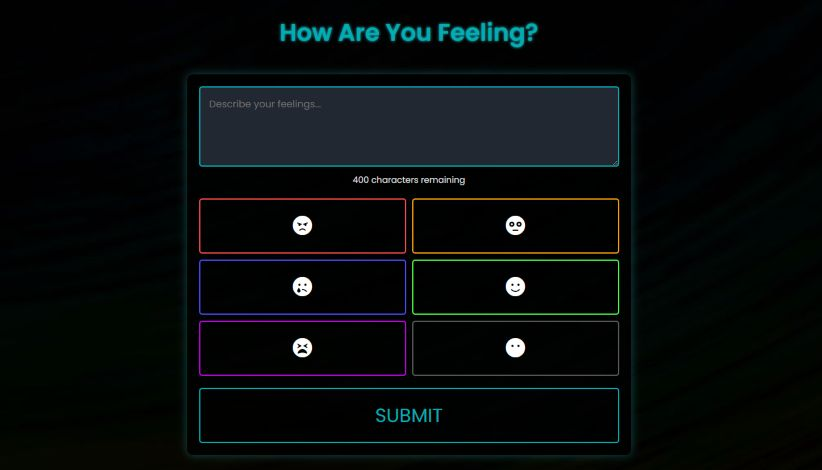

# Feeling Tracker



## Table of Contents
- [Demo](#demo)
- [Overview](#overview)
- [Features](#features)
- [File Structure](#file-structure)
- [Installation](#installation)
    - [Step 1: Download and Prepare Files](#step-1-download-and-prepare-necessary-installation-files)
    - [Step 2: Install the webserver and packages](#step-2-install-the-webserver-and-needed-dependancy-packages)
    - [Step 3: Update Nginx host conf file](#step-3-update-your-nginx-conf-file)
    - [Step 4: Verify firewall rules](#step-4-ensure-firewall-rules-allow-for-80-and-443)
    - [Step 5: Enable SSL](#step-5-enable-ssl)
    - [Step 6: Test the website](#step-6-test-your-website)
- [License](#license)

## Demo
A demonstration of the feeling tracker can be found here: [demo.yoft.org](https://demo.yoft.org)

Use `demo` / `demo` for the username and password to access the site.

The historical entries are cleared every **15 minutes** automatically.

**Please do not put any personal information in the demo site!**

## Overview
The **Feeling Tracker** is a simple web application that allows users to document and reflect on their emotions by selecting from predefined emotions and writing down some notes regarding the feeling they had. This application also maintains a history of submissions, allowing users to review their past entries.

I needed an easy way to do this, and I know there are others out there, likely much more refined. That said, I wanted one of my own creation, and simple.

## Features
- **Emotion Buttons**: Users can select from a variety of emotions (e.g., Anger, Fear, Sad, Happy, Tired, Meh).
- **Text Area**: Users can describe their feelings in a text area with a character limit of 400 characters.
- **Submission History**: A dynamic section displays the history of user submissions.
- **Responsive Design**: The application is designed to be responsive and works on various screen sizes.

## File Structure
The web files are organized as follows when deployed.

```
Feeling-Tracker/
├── css/
│   └── default.css       # Main stylesheet for the application
├── js/
│   └── feeling.js        # JavaScript file for handling user interactions
├── media/
│   └── feeling-bg.jpg    # Background image for the site
├── php/
│   └── submissions.php   # PHP file for handling SQLite database entries.
├── images/
│   └── icons/            # Icons for favicons and other purposes
├── index.html            # Main HTML file for the application
```

## Installation
### NOTE:

This procedure has only been tested on a fresh installation of Ubuntu 22.04 hosted in Vultr. I have not done testing in other releases or Linux flavors.

It is recommended to deploy this application to a standalone dedicated server as the installation and uninstallation scripts perform global operations on the server such as Nginx provisioning and de-provisioning, certbot installations, Nginx configs and more.  

100% recommend give this it's own dedicated VPS. You can get some pretty cheap ones out there.

### Step 1: Download and prepare necessary installation files
Download the setup installation script and make it executible. The script contains several arguments that can help with the site management.

```
wget "https://raw.githubusercontent.com/travisnwade/yoft/main/feeling-tracker/files/setup_feeling_tracker.sh"
chmod +x setup_feeling_tracker.sh
./setup_feeling_tracker.sh
```

When run, the script downloads and places needed installation and configuration files in the `/opt/feeling-tracker/` directory. This needs to be done first before the web application gets installed and necessary dependancies. This is because the script handles that portion for us.

When the script finishes, you should have a directory like so:
```
/opt/feeling-tracker/
├── feeling-tracker                 # Nginx default conf file
├── feeling-tracker.zip             # Web app files
├── install_web_server_nginx.sh     # Installs all necessary packages to run the application such as Nginx, PHP, SQLite3, certbot, etc.
└── uninstall_web_server_nginx.sh   # Uninstalls everything the script above installs (even if you already had it installed! You've been warned!)
```

#### Available Script Arguments

```
--download-only         # Download the necessary files to /opt/feeling-tracker without performing any other operations.

--refresh-webroot       # Refresh the webroot directory with latest from source.

--install               # Run the install script to setup the webserver.

--uninstall             # This uninstalls everything that the script installed. This will uninstall NGINX, PHP, SQLite, etc.

--backup-db             # Backs up the submissions.db file to /opt/feeling-tracker/db_backups

--restore-db            # Restores the submissions.db file.

--help                  # A help file for reminding you what these do.
```

If no argument is passed, then `./setup_feeling_tracker.sh` and `./setup_feeling_tracker.sh --download-only` are the same thing. (It'll create and populate `/opt/feeling-tracker/` with the latest files). So if you make edits in that directory and run the script without an argument or with `--download-only`, then your edits will be overwritten. If you want to customize things, move them somewhere else.

### Step 2: Install the webserver and needed dependancy packages

Install the necessary packages and configure the webserver:
```
./setup_feeling_tracker.sh --install
```
During the installation, you'll be asked for a username and password. This is to set credentials for Nginx basic auth (this is sort of a personal web app after all)

When the script is complete, you'll see an information block recommending next steps that need to be done on your part:
```
-------------------------------------------
Installation complete. Your feeling tracker web server is ready.
You can now visit your feeling tracker at http://localhost or your server's domain or IP address.
-------------------------------------------
*** FOR YOU TO DO NEXT ***

1.  Update the server_name block to your domain in:
          /etc/nginx/sites-available/feeling-tracker
          to use your own domain and if you plan on using Certbot (see below).

2.  Update your firewall rules for 80 and 443 to be allowed (required by certbot)
          Example: sudo ufw allow 80,443/tcp && sudo ufw reload

3.  The basic auth user 'YOUR-USERNAME-YOU-SET' has been created.

    3.a  If you want to change this user, update the .htpasswd file at:
         /etc/nginx/.htpasswd

    Then restart the Nginx service.
    sudo systemctl restart nginx.service

4.  For SSL (certbot is already loaded and ready):
    sudo certbot --nginx -d YOURDOMAIN --agree-tos --no-eff-email -m YOU@YOURDOMAIN.com
-------------------------------------------
```

### Step 3: Update your Nginx conf file
```
sudo nano /etc/nginx/sites-available/feeling-tracker
```
Update this block to your domain (change `localhost` to your domain):
```
server {
    server_name localhost;
    # For your own domain, change localhost above to your domain.
```

### Step 4: Ensure firewall rules allow for 80 and 443
This will vary depending on provider, but ensure your webserver can respond on both 80 and 443. For what I use (Vultr):
```
sudo ufw allow 80
sudo ufw allow 443
sudo ufw reload
```

### Step 5: Enable SSL
If you have your domain pointed to the server, and it's reachable over 80 and 443, you are ready to provision a certificate:
```
sudo certbot --nginx -d YOURDOMAIN --agree-tos --no-eff-email -m YOU@YOURDOMAIN.com
```

### Step 6: Test your website
If you visit your newly deployed feeling-tracker web app, you should first be presented with a login prompt. Once you login, you should see the main interface like the screenshot at the top of this README. Test that you can input some notes along with a mood. You should see a history below the form to reflect on at later dates.

## License

This project is licensed under the MIT License - see the [LICENSE](LICENSE) file for details.